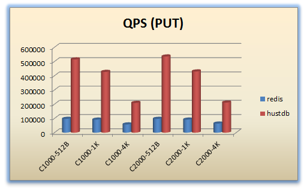
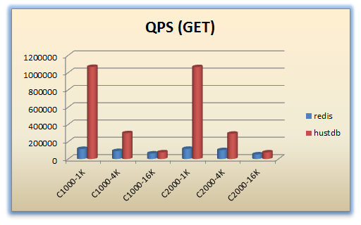

[简体中文](README_ZH.md)

# huststore - High-performance Distributed Storage #

`huststore` is a open source high performance distributed database system. It not only provides key-value storage service with extremely high performance, up to **hundreds of thousands QPS**, but also supports data structures like `hash`, `set`, `sorted set`, etc. Also, it can store **binary** data as value from a key-value pair, and thus can be used as an alternative of Redis.

In addtion, `huststore` implements a distributed message queue by integrating a special `HA` module, features including message Push Stream, and message Publish-SubScribe.

## Features ##
`huststore` has two core components, `hustdb` and `HA`. `hustdb` is a database engine developed by our own, in the fundamental architecture. `HA` is implemented as a `nginx` module. It is well-known that `nginx` is a industry-proven high quality code base, thus by inheriting it `huststore` gains the below advantages:

* High Throughput  
`hustdb` uses [libevhtp](https://github.com/ellzey/libevhtp), a open source network library, as the inner network communication system, by incorporating it with high-performance storage engine, `hustdb` achieves a extremely high performance, the benchmark shows that `QPS` hits **hundreds of thousands** and even more.

* High Concurrency  
Please refer to concurrency report of `nginx` for more details.

* High Availability  
`huststore` architecture provides `Replication` (master-master) and `load balance` support. Therefore, the availability of `HA` is guaranteed by `master-worker` design. When one of `worker` process is down, the `master` will load another `workder` process, since multiple `worker`s work independently, the `HA` is guaranteed to work steadily.
The fundamental design architecture of `huststore` guarantees the high availability, by using `master-master` architecture, when one of the storage node fails, `HA` module will re-direct the request to another living `master` node. Also, when a node failure happens, `HA` cluster will automatically re-balance the data distribution, thus avoid single point of failure.
In addition, `HA` cluster uses a distributed architecture design by incorporating LVS as the director, each `HA` node is separated and work independently. When one of the `HA` node is down, `LVS` will re-direct the request to other available `HA` node, thus avoids `HA`'s failure on single point node.

* Language-free Interface  
`huststore` use `http` as the communication protocol, therefore the client side implementation is not limited in any specific programming language.

* Persistence  
**You do not need to worry about the loss of data** as most of interfaces will persist data to disk.  

* Support Binary Key-Value  
* Support Version Clock

## Operation and Maintenance ##

### Architect ###

### Deployment ###
* Distributed KV storage  : HA (hustdb ha) + DB (hustdb)
* Distributed Message Queue  : HA (hustmq ha) + DB (hustdb)

## Database Engine ##

## Dependency ##
* [cmake](https://cmake.org/download/)
* [leveldb](https://github.com/google/leveldb)
* [libcurl](https://curl.haxx.se/libcurl/)
* [libevent2](http://libevent.org/)
* [libevhtp](https://github.com/ellzey/libevhtp)
* [zlog](https://github.com/HardySimpson/zlog)
* [zlib](https://zlib.net/)

## Platforms ##

Tested platforms so far:

Platform         | Description
-----------------|----------------------------------------------------------
CentOS 6.x & 7.x | kernel >= 2.6.32 (GCC 4.4.7)

## Quick Start ##

Read the [Quick Start](quickstart.md).

## Documents ##

* [hustdb](hustdb/doc/doc/en/index.md)
* [hustmq](hustmq/doc/doc/en/index.md)

Above includes detailed documents of design, deployments, `API` usage and test samples. You can refer quickly to common problems in `FAQ` part.

## Performance ##

### Environment ###

    CPU: Intel(R) Xeon(R) CPU E5-2683 v4 @ 2.10GHz (2socket*16cores)
    Memory: 192G
    Disk: Intel SSD DC S3520 Series (800GB, 2.5in SATA 6Gb/s, 3D1, MLC)
    Network Adapter: Intel Ethernet 10G 2P X520 Adapter
    OS: CentOS Linux release 7.2.1511 (3.10.0-327.el7.x86_64)

### Test 1 -  Worker ###

#### Purpose ####

With different number of hustdb worker threads, we test hustdb's max QPS.

#### Condition ####

storage capacity : 512GB  

concurrent connection : 1000

value : **1KB**

md5db cache : **disabled**  

data compression : **disabled**  

Threads are not bound to CPU cores.

#### Result ####

Description : Horizontal axis is the number of worker threads; Vertical axis is the QPS. The value size is **1KB** .

#### Conclusion ####

The best hustdb worker threads number is 36-40.  

### Test 2 -  RTT ###

#### Purpose ####

With the optimal worker threads number, we test hustdb's round-trip time.  

#### Condition ####

storage capacity : 512GB  

concurrent connection : 200

value : **1KB**

md5db cache : **disabled**  

data compression : **disabled**  

Threads are not bound to CPU cores.

#### Result ####

    # GET
    Thread Stats   Avg      Stdev     Max   +/- Stdev
        Latency   238.94us   95.42us   9.33ms   81.03%
        Req/Sec    31.44k     1.09k   36.30k    63.68%
    Latency Distribution
        50%  220.00us
        75%  288.00us
        90%  343.00us
        99%  482.00us
    11333230 requests in 15.10s, 11.10GB read
    Requests/sec: 750635.81
    Transfer/sec:    752.65MB
    --------------------------------------------------
    [Latency Distribution]  0.01%  0.07ms
    [Latency Distribution]   0.1%  0.07ms
    [Latency Distribution]   0.5%  0.09ms
    [Latency Distribution]     1%  0.09ms
    [Latency Distribution]     3%  0.12ms
    [Latency Distribution]     5%  0.13ms
    [Latency Distribution]    10%  0.15ms
    [Latency Distribution]    20%  0.17ms
    [Latency Distribution]    30%  0.19ms
    [Latency Distribution]    40%  0.20ms
    [Latency Distribution]    50%  0.22ms
    [Latency Distribution]    60%  0.25ms
    [Latency Distribution]    70%  0.28ms
    [Latency Distribution]    80%  0.30ms
    [Latency Distribution]    90%  0.34ms
    [Latency Distribution]    91%  0.35ms
    [Latency Distribution]    92%  0.36ms
    [Latency Distribution]    93%  0.37ms
    [Latency Distribution]  93.5%  0.37ms
    [Latency Distribution]    94%  0.38ms
    [Latency Distribution]  94.5%  0.38ms
    [Latency Distribution]    95%  0.39ms
    [Latency Distribution]  95.5%  0.39ms
    [Latency Distribution]    96%  0.40ms
    [Latency Distribution]  96.5%  0.40ms
    [Latency Distribution]    97%  0.41ms
    [Latency Distribution]  97.5%  0.42ms
    [Latency Distribution]    98%  0.43ms
    [Latency Distribution]  98.5%  0.45ms
    [Latency Distribution]    99%  0.48ms
    [Latency Distribution]  99.1%  0.49ms
    [Latency Distribution]  99.2%  0.50ms
    [Latency Distribution]  99.3%  0.51ms
    [Latency Distribution]  99.4%  0.52ms
    [Latency Distribution]  99.5%  0.53ms
    [Latency Distribution]  99.6%  0.56ms
    [Latency Distribution]  99.7%  0.59ms
    [Latency Distribution]  99.8%  0.64ms
    [Latency Distribution]  99.9%  0.76ms
    [Latency Distribution]  99.99%  1.85ms
    [Latency Distribution]  99.999%  4.07ms

    # PUT
    Thread Stats   Avg      Stdev     Max   +/- Stdev
        Latency   495.13us  393.71us  21.29ms   93.06%
        Req/Sec    16.37k     1.33k   23.72k    74.26%
    Latency Distribution
        50%  447.00us
        75%  623.00us
        90%  815.00us
        99%    1.28ms
    17628712 requests in 45.10s, 1.53GB read
    Requests/sec: 390880.11
    Transfer/sec:     34.67MB
    --------------------------------------------------
    [Latency Distribution]  0.01%  0.09ms
    [Latency Distribution]   0.1%  0.10ms
    [Latency Distribution]   0.5%  0.12ms
    [Latency Distribution]     1%  0.12ms
    [Latency Distribution]     3%  0.14ms
    [Latency Distribution]     5%  0.17ms
    [Latency Distribution]    10%  0.20ms
    [Latency Distribution]    20%  0.26ms
    [Latency Distribution]    30%  0.33ms
    [Latency Distribution]    40%  0.39ms
    [Latency Distribution]    50%  0.45ms
    [Latency Distribution]    60%  0.51ms
    [Latency Distribution]    70%  0.58ms
    [Latency Distribution]    80%  0.67ms
    [Latency Distribution]    90%  0.81ms
    [Latency Distribution]    91%  0.84ms
    [Latency Distribution]    92%  0.86ms
    [Latency Distribution]    93%  0.89ms
    [Latency Distribution]  93.5%  0.90ms
    [Latency Distribution]    94%  0.92ms
    [Latency Distribution]  94.5%  0.93ms
    [Latency Distribution]    95%  0.95ms
    [Latency Distribution]  95.5%  0.97ms
    [Latency Distribution]    96%  0.99ms
    [Latency Distribution]  96.5%  1.02ms
    [Latency Distribution]    97%  1.05ms
    [Latency Distribution]  97.5%  1.08ms
    [Latency Distribution]    98%  1.13ms
    [Latency Distribution]  98.5%  1.19ms
    [Latency Distribution]    99%  1.28ms
    [Latency Distribution]  99.1%  1.30ms
    [Latency Distribution]  99.2%  1.33ms
    [Latency Distribution]  99.3%  1.37ms
    [Latency Distribution]  99.4%  1.41ms
    [Latency Distribution]  99.5%  1.47ms
    [Latency Distribution]  99.6%  1.56ms
    [Latency Distribution]  99.7%  1.73ms
    [Latency Distribution]  99.8%  2.24ms
    [Latency Distribution]  99.9%  4.23ms
    [Latency Distribution]  99.99%  7.22ms
    [Latency Distribution]  99.999%  9.62ms

### Test 3 -  vs Redis ###

#### Version ####

* [redis 4.0.9](https://redis.io/)

#### Tools ####

* [redis-benchmark](https://redis.io/topics/benchmarks)
* [wrk](https://github.com/wg/wrk)

#### Condition ####

storage capacity : 512GB  

md5db cache : **disabled**  

data compression : **disabled**  

Threads are not bound to CPU cores.

#### Arguments ####

abbr       |concurrent connection |value
-----------|----------------------|--------------
C1000-512B |1000                  |512B
C1000-1K   |1000                  |1KB
C1000-4K   |1000                  |4KB
C2000-512B |2000                  |512B
C2000-1K   |2000                  |1KB
C2000-4K   |2000                  |4KB

#### PUT ####

#### GET ####

See more details in [here](benchmark/README.md)

## LICENSE ##

`huststore` is licensed under [LGPL-3.0](https://www.gnu.org/licenses/lgpl-3.0.en.html), a very flexible license to use.

## Authors ##

* XuRuibo（hustxrb, hustxrb@163.com)  
* ChengZhuo（jobs, yao050421103@163.com)  

## More ##

- Nginx module development kit - [hustngx](https://github.com/jobs-github/hustngx)