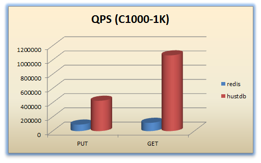
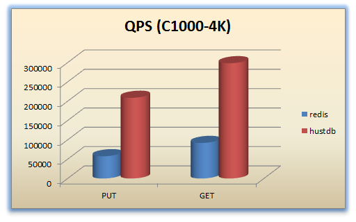
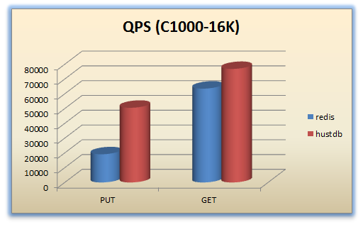
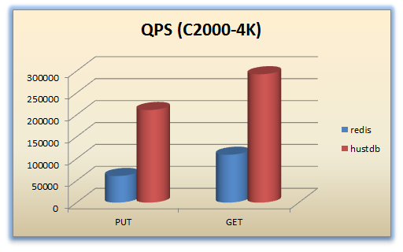
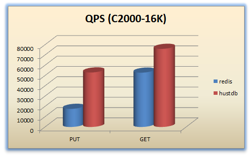

<h1 id="id_top">Huststore Benchmark</h1>

* [Guide](#id_guide)  
    * [Dependency](#id_guide_dep)  
    * [Configuration](#id_guide_cfg)  
    * [Usage](#id_guide_usage)  
* [Advanced](#id_advanced)  
    * [Cases](#id_advanced_cases)  
    * [Tools](#id_advanced_tools)  
    * [FAQ](#id_advanced_faq)  
* [Appendix](#id_appendix)
    * [Benchmark Configuration](#id_appendix_conf)
    * [Benchmark Result](#id_appendix_result)
    * [Benchmark Log](benchmark/index.md)

<h2 id="id_guide">Guide</h2>

<h3 id="id_guide_dep">Dependency</h3>

* [wrk](https://github.com/wg/wrk)

Note: please copy the binary `wrk` to `/usr/local/bin` after compiled.  

[Back to top](#id_top)

<h3 id="id_guide_cfg">Configuration</h3>

A complete example of configuration file:  

    {
        "wrk":
        {
            "threads": 12,
            "connections": 1000,
            "duration": "10s",
            "timeout": "10s",
            "loop": 30
        },
        "data":
        {
            "256B": 256,
            "512B": 512,
            "1KB": 1024,
            "4KB": 4096,
            "16KB": 16384,
            "64KB": 65536
        },
        "srv":
        {
            "hustdb": "192.168.1.101:8085",
            "hustmq": "192.168.1.101:8086",
            "hustdbha": "192.168.1.101:8082",
            "hustmqha": "192.168.1.101:8080"
        },
        "latency_distribution": ["50", "75", "90", "99", "99.999"],
        "separator": "@huststore_benchmark",
        "status":
        {
            "loop_file": "loop.txt",
            "status_file": "status.txt"
        },
        "outputs":
        [
            "hustdb_put.lua",
            "hustdb_get.lua"
        ]
    }

**Note**

* `wrk`  
    * `threads`: number of threads to use, **the cpu cores at most recommended**  
    * `connections`: connections to keep open  
    * `duration`: duration of test for each loop, recommended value: `[3s, 30s]`  
    * `timeout`: socket/request timeout, the value of `duration` at most recommended
    * `loop`: number of rounds of each test  
* `data`: to specify the data size of request, key as the name of folder where cases are generated, value as the size of data  
* `srv`: to specify the addresses of huststore's services, please configure by your specific test environment  
* `latency_distribution`: for the latency statistics, each of item shows the percentage  
* `separator`: separator of results for test cases, used by log analysis  
* `status`  
    * `loop_file`: to record the number of rounds (this value is used to generate the `key` of request to avoid duplicated keys when a test case is executed for multiple times)  
    * `status_file`: to record the state information of test case(number of requests in threads) to ensure the `key` is not out of range. 
      Note: we can only set the duration of test by arguments of `wrk` as it's hard to accurately control the number of requests in threads. 
* `outputs`: the generated files of test cases, please refer to the full list [here](#id_advanced_cases).  
  Note: if the tag "outputs" is skipped, all test cases will be generated.  

[Back to top](#id_top)

<h3 id="id_guide_usage">Usage</h3>

Firstly, configure `wrk.json`, details of tags are [here](#id_guide_cfg)  

Secondly, run: 

    python init.py wrk.json

If you use the configuration of [sample](#id_guide_cfg) as input, the following folders will be generated:  

    256B
    512B
    1KB
    4KB
    16KB
    64KB

Sample files in each folder:  

    benchmark.sh
    data
    hustdb_put.lua
    hustdb_put.sh
    hustdb_get.lua
    hustdb_get.sh

Run the benchmark:  

    sh benchmark.sh

Then the results are generated:  

    hustdb_put.log
    hustdb_put.json
    hustdb_get.log
    hustdb_get.json

You can get the details of performance by `*.log`, and summray report(average value) by `*.json`.  

[Back to top](#id_top)

<h2 id="id_advanced">Advanced</h2>

<h3 id="id_advanced_cases">Cases</h3>

`huststore/benchmark/tpl/uri_table.json` includes the full cases supported by `Huststore Benchmark`.  
You can check the `outputs` of [wrk.json](#id_guide_cfg) by refer to the last column of each record in `uri_table.json`. So far the full list:  

    hustcache_put.lua
    hustcache_exist.lua
    hustcache_get.lua
    hustcache_del.lua
    hustcache_hset.lua
    hustcache_hexist.lua
    hustcache_hget.lua
    hustcache_hdel.lua
    hustdb_put.lua
    hustdb_exist.lua
    hustdb_get.lua
    hustdb_del.lua
    hustdb_hset.lua
    hustdb_hexist.lua
    hustdb_hget.lua
    hustdb_hdel.lua
    hustdb_sadd.lua
    hustdb_sismember.lua
    hustdb_srem.lua
    hustdb_zadd.lua
    hustdb_zismember.lua
    hustdb_zscore.lua
    hustdb_zrem.lua
    hustmq_put.lua
    hustmq_worker.lua
    hustmq_lock.lua
    hustmq_max.lua
    hustmq_get.lua
    ha_hustcache_put.lua
    ha_hustcache_exist.lua
    ha_hustcache_get.lua
    ha_hustcache_del.lua
    ha_hustcache_hset.lua
    ha_hustcache_hexist.lua
    ha_hustcache_hget.lua
    ha_hustcache_hdel.lua
    ha_hustdb_put.lua
    ha_hustdb_exist.lua
    ha_hustdb_get.lua
    ha_hustdb_get2.lua
    ha_hustdb_del.lua
    ha_hustdb_hset.lua
    ha_hustdb_hexist.lua
    ha_hustdb_hget.lua
    ha_hustdb_hget2.lua
    ha_hustdb_hdel.lua
    ha_hustdb_sadd.lua
    ha_hustdb_sismember.lua
    ha_hustdb_sismember2.lua
    ha_hustdb_srem.lua
    ha_hustdb_zadd.lua
    ha_hustdb_zismember.lua
    ha_hustdb_zscore.lua
    ha_hustdb_zscore2.lua
    ha_hustdb_zrem.lua
    ha_hustmq_put.lua
    ha_hustmq_worker.lua
    ha_hustmq_lock.lua
    ha_hustmq_max.lua
    ha_hustmq_get.lua

[Back to top](#id_top)

<h3 id="id_advanced_tools">Tools</h3>

#### gendata.py ####

Used to generate the data of request.  

    usage:
        python gendata.py [bytes] [output]
    sample:
        python gendata.py 256 256B/data

#### gencases.py ####

Used to generate test cases to the specified folder.  

    usage:
        python gencases.py [conf] [output]
    sample:
        python gencases.py wrk.json .

#### runcase.py ####

Used to batch execute the test case, and output the result by separator to the log file.  

    usage:
        python runcase.py [script] [loop] [separator] [output]
    sample:
        python runcase.py hustdb_put.sh 5 @huststore_benchmark hustdb_put.log

#### analyze.py ####

Used to analyze the generated log file to get summary of test results for benchmark report.  

    usage:
        python analyze.py [log] [separator] [output]
    sample:
        python analyze.py hustdb_put.log @huststore_benchmark hustdb_put.json

#### init.py ####

Entry of benchmark, used for the initialization of test cases.  

    usage:
        python init.py [conf]
    sample:
        python init.py wrk.json

[Back to top](#id_top)

<h3 id="id_advanced_faq">FAQ</h3>

### Q: Are arguments of requests invariable or not? ###

**Variable**. Take `/hustdb/put` as example, the `key` of each request is generated as following:  

    function get_key(loop, id, requests)
        return string.format("benchmark_key_%d_%d_%d", loop, id, requests)
    end

You can see the `key` depends on 3 arguments:  

* loop : the current rounds of test case, from 0 by default, increase by 1 every time the test case is executed(this value is recorded in file)  
* id : the sequence number of thread, different thread owns different sequence number  
* requests : number of sent requests, from 0 by default, increase by 1 when a request is sent

Variation of `requests` ensures that each request owns a unique `key` in a thread;  
Variation of `id` ensures that different threads will not generate duplicated keys;  
Variation of `loop` avoids duplicated keys for each round of test.  

Besides, the `body` is concatenated by the data (generated by `gendata.py`) and `key`:  

    --make_request
    local key = get_key(loop, id, requests)
    uri = string.format("/hustdb/put?key=%s", key)
    local bufs = { [1] = body, [2] = key }
    wrk.body = table.concat(bufs, "")

As different requests own different keys, the generated `body` will be unique as well. 

[Back to top](#id_top) 

<h2 id="id_appendix">Appendix</h2>

<h3 id="id_appendix_conf">Benchmark Configuration</h3>

The configuration of Huststore Benchmark:

    {
        "wrk":
        {
            "threads": 24,
            "connections": 2000,
            "duration": "30s",
            "timeout": "10s",
            "loop": 10
        },
        "data":
        {
            "1KB": 976,
            "4KB": 4048,
            "16KB": 16336
        },
        "srv":
        {
            "hustdb": "0.0.0.0:8085"
        },
        "latency_distribution":
        [
            "0.01", "0.1", "0.5", "1", "3", "5", 
            "10", "20", "30", "40", "50", "60", "70", "80", "90", "91", "92", 
            "93", "93.5", "94", "94.5", "95", "95.5", "96", "96.5", "97", "97.5", "98", "98.5", 
            "99", "99.1", "99.2", "99.3", "99.4", "99.5", "99.6", "99.7", "99.8", "99.9", "99.99", "99.999"
        ],
        "separator": "@huststore_benchmark",
        "status":
        {
            "loop_file": "loop.txt",
            "status_file": "status.txt"
        },
        "outputs":
        [
            "hustdb_put.lua",
            "hustdb_get.lua"
        ]
    }

Please configure the "srv" tag by your specific test environment.  

redis-benchmark arguments as following:

    # For "redis", please replace "0.0.0.0" & "6379" by the specific IP & Port
    redis-benchmark -e -h 0.0.0.0 -p 6379 -c 1000 -n 1000000 -d 976 -t set,get
    redis-benchmark -e -h 0.0.0.0 -p 6379 -c 1000 -n 1000000 -d 4048 -t set,get
    redis-benchmark -e -h 0.0.0.0 -p 6379 -c 1000 -n 1000000 -d 16336 -t set,get
    redis-benchmark -e -h 0.0.0.0 -p 6379 -c 2000 -n 1000000 -d 976 -t set,get
    redis-benchmark -e -h 0.0.0.0 -p 6379 -c 2000 -n 1000000 -d 4048 -t set,get
    redis-benchmark -e -h 0.0.0.0 -p 6379 -c 2000 -n 1000000 -d 16336 -t set,get

[Back to top](#id_top)

<h3 id="id_appendix_result">Benchmark Result</h3>

#### C1000-1K ####

[Back to top](#id_top)

#### C1000-4K ####

[Back to top](#id_top)

#### C1000-16K ####

[Back to top](#id_top)

#### C2000-1K ####

[Back to top](#id_top)

#### C2000-4K ####

[Back to top](#id_top)

#### C2000-16K ####

[Back to top](#id_top)

[Home](../README.md)