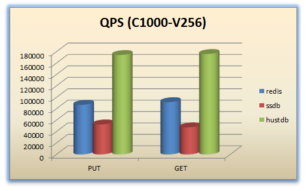
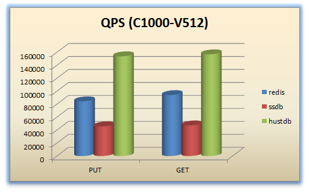
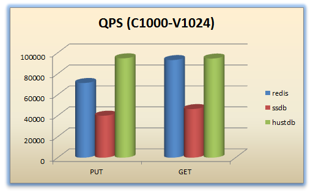
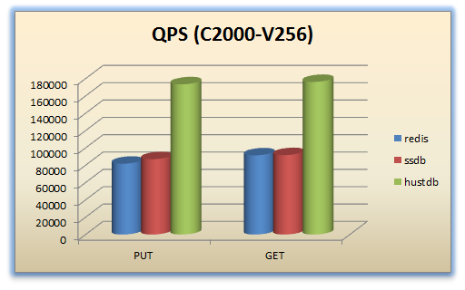
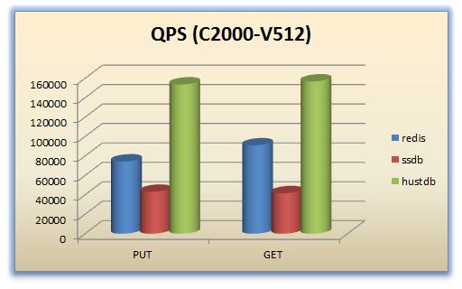
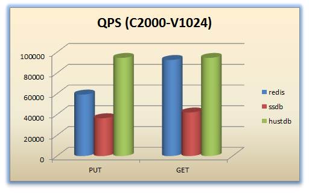

<h1 id="id_top">Huststore Benchmark</h1>

* [快速入门](#id_guide)  
    * [依赖](#id_guide_dep)  
    * [配置](#id_guide_cfg)  
    * [使用](#id_guide_usage)  
* [进阶](#id_advanced)  
    * [用例](#id_advanced_cases)  
    * [工具](#id_advanced_tools)  
    * [FAQ](#id_advanced_faq)  
* [附录](#id_appendix)
    * [性能测试配置](#id_appendix_conf)
    * [性能测试结果](#id_appendix_result)
    * [性能测试日志](benchmark/index_zh.md)

<h2 id="id_guide">快速入门</h2>

<h3 id="id_guide_dep">依赖</h3>

* [wrk](https://github.com/wg/wrk)

备注：安装 `wrk` 时请将编译好的二进制文件拷贝至 `/usr/local/bin` 下面  

[回顶部](#id_top)

<h3 id="id_guide_cfg">配置</h3>

以下是一个完整的配置文件：

    {
        "wrk":
        {
            "threads": 12,
            "connections": 1000,
            "duration": "10s",
            "timeout": "10s",
            "loop": 30
        },
        "data":
        {
            "256B": 256,
            "512B": 512,
            "1KB": 1024,
            "4KB": 4096,
            "16KB": 16384,
            "64KB": 65536
        },
        "srv":
        {
            "hustdb": "192.168.1.101:8085",
            "hustmq": "192.168.1.101:8086",
            "hustdbha": "192.168.1.101:8082",
            "hustmqha": "192.168.1.101:8080"
        },
        "latency_distribution": ["50", "75", "90", "99", "99.999"],
        "separator": "@huststore_benchmark",
        "status":
        {
            "loop_file": "loop.txt",
            "status_file": "status.txt"
        },
        "outputs":
        [
            "hustdb_put.lua",
            "hustdb_get.lua"
        ]
    }

**备注**

* `wrk`  
    * `threads`: 使用的线程数量，建议 **不要超过机器 `CPU` 的核心数量**  
    * `connections`: 开启的并发连接数  
    * `duration`: 单个用例持续的时间，建议的值：`[3s, 30s]`  
    * `timeout`: 单个请求的超时时间，该值应不大于 `duration`  
    * `loop`: 单个用例执行的轮数  
* `data`: 用于配置请求的数据大小，键作为用例目录的名字，值作为请求数据的大小  
* `srv`: 用于配置 `huststore` 各个服务的地址，请根据实际的测试环境进行配置  
* `latency_distribution`: 用于统计请求的延时分布，每项的值表示百分比  
* `separator`: 测试用例各项结果之间的分隔符，用于日志分析  
* `status`  
    * `loop_file`: 记录用例执行的轮数（该值用于生成请求的 `key`，以确保同一个用例在执行多轮的情况下，每一轮生成的 `key` 不会重复）  
    * `status_file`: 记录每一轮用例执行的状态信息（各个线程的请求数量），以保证用例请求的 `key` 不越界。备注：`wrk` 的输入参数只能控制时间，不能精确控制各个线程的请求数量
* `outputs`: 生成的用例的文件列表，完整的列表请参考[这里](#id_advanced_cases)。  
配置中如果不包含 `outputs` 的字段，默认会生成全部的用例。

[回顶部](#id_top)

<h3 id="id_guide_usage">使用</h3>

首先配置 `wrk.json`，字段的细节请参考[这里](#id_guide_cfg)  

然后运行如下命令：

    python init.py wrk.json

以[样例](#id_guide_cfg)中的配置作为输入，会生成如下几个目录：

    256B
    512B
    1KB
    4KB
    16KB
    64KB

每个目录下的文件类似于：

    benchmark.sh
    data
    hustdb_put.lua
    hustdb_put.sh
    hustdb_get.lua
    hustdb_get.sh

执行用例：

    sh benchmark.sh

执行完之后，会生成如下的结果文件：

    hustdb_put.log
    hustdb_put.json
    hustdb_get.log
    hustdb_get.json

其中， `*.log` 记录了每轮用例执行的详细性能数据，`*.json` 是对前者的汇总，记录平均值。

[回顶部](#id_top)

<h2 id="id_advanced">进阶</h2>

<h3 id="id_advanced_cases">用例</h3>

`huststore/benchmark/tpl/uri_table.json` 文件记录了 `Huststore Benchmark` 所支持的完整的用例。 
[wrk.json](#id_guide_cfg) 的 `outputs` 对应于 `uri_table.json` 中每个记录的最后一列。目前完整的列表如下：

    hustcache_put.lua
    hustcache_exist.lua
    hustcache_get.lua
    hustcache_del.lua
    hustcache_hset.lua
    hustcache_hexist.lua
    hustcache_hget.lua
    hustcache_hdel.lua
    hustdb_put.lua
    hustdb_exist.lua
    hustdb_get.lua
    hustdb_del.lua
    hustdb_hset.lua
    hustdb_hexist.lua
    hustdb_hget.lua
    hustdb_hdel.lua
    hustdb_sadd.lua
    hustdb_sismember.lua
    hustdb_srem.lua
    hustdb_zadd.lua
    hustdb_zismember.lua
    hustdb_zscore.lua
    hustdb_zrem.lua
    hustmq_put.lua
    hustmq_worker.lua
    hustmq_lock.lua
    hustmq_max.lua
    hustmq_get.lua
    ha_hustcache_put.lua
    ha_hustcache_exist.lua
    ha_hustcache_get.lua
    ha_hustcache_del.lua
    ha_hustcache_hset.lua
    ha_hustcache_hexist.lua
    ha_hustcache_hget.lua
    ha_hustcache_hdel.lua
    ha_hustdb_put.lua
    ha_hustdb_exist.lua
    ha_hustdb_get.lua
    ha_hustdb_get2.lua
    ha_hustdb_del.lua
    ha_hustdb_hset.lua
    ha_hustdb_hexist.lua
    ha_hustdb_hget.lua
    ha_hustdb_hget2.lua
    ha_hustdb_hdel.lua
    ha_hustdb_sadd.lua
    ha_hustdb_sismember.lua
    ha_hustdb_sismember2.lua
    ha_hustdb_srem.lua
    ha_hustdb_zadd.lua
    ha_hustdb_zismember.lua
    ha_hustdb_zscore.lua
    ha_hustdb_zscore2.lua
    ha_hustdb_zrem.lua
    ha_hustmq_put.lua
    ha_hustmq_worker.lua
    ha_hustmq_lock.lua
    ha_hustmq_max.lua
    ha_hustmq_get.lua

[回顶部](#id_top)

<h3 id="id_advanced_tools">工具</h3>

#### gendata.py ####

用于生成数据文件。

    usage:
        python gendata.py [bytes] [output]
    sample:
        python gendata.py 256 256B/data

#### gencases.py ####

用于生成测试用例到指定目录。

    usage:
        python gencases.py [conf] [output]
    sample:
        python gencases.py wrk.json .

#### runcase.py ####

用于批量运行测试用例，并根据输入的间隔符将结果输出到日志文件。

    usage:
        python runcase.py [script] [loop] [separator] [output]
    sample:
        python runcase.py hustdb_put.sh 5 @huststore_benchmark hustdb_put.log

#### analyze.py ####

用于分析 `runcase.py` 生成的日志文件，统计整体结果，并输出性能测试报告。

    usage:
        python analyze.py [log] [separator] [output]
    sample:
        python analyze.py hustdb_put.log @huststore_benchmark hustdb_put.json

#### init.py ####

工程的入口点，用于初始化所有的测试用例。

    usage:
        python init.py [conf]
    sample:
        python init.py wrk.json

[回顶部](#id_top)

<h3 id="id_advanced_faq">FAQ</h3>

### Q: 测试用例每次使用的请求参数是不变的还是可变的？ ###

不固定，以 `/hustdb/put` 接口为例，每次请求的 `key` 生成的方法如下：

    function get_key(loop, id, requests)
        return string.format("benchmark_key_%d_%d_%d", loop, id, requests)
    end

可以看到，生成 `key` 依赖于三个变量：  

* loop : 当前脚本执行的轮数，默认从0开始，脚本每执行一次，值加一（这个值会记录在文件里）  
* id : 线程序号，每个线程的序号都不同  
* requests : 已发送的请求数量，从0开始，每发送一个请求，值加一  

`requests` 的变化保证了同一个线程内，每个请求的 `key` 都不会重复；  
`id` 的变化保证了任意两个线程生成的 `key` 都不会重复；  
`loop` 的变化保证了任意两次脚本执行时使用的 `key` 都不会重复。

另外，`body` 是由 `gendata.py` 生成的数据和 `key` 拼接而来：

    --make_request
    local key = get_key(loop, id, requests)
    uri = string.format("/hustdb/put?key=%s", key)
    local bufs = { [1] = body, [2] = key }
    wrk.body = table.concat(bufs, "")

由于任意两个请求的key都不会重复，因此生成的 `body` 也是不会重复的。

[回顶部](#id_top) 

<h2 id="id_appendix">附录</h2>

<h3 id="id_appendix_conf">性能测试配置</h3>

`Huststore Benchmark` 的配置如下：

    {
        "wrk":
        {
            "threads": 16,
            "connections": 2000,
            "duration": "10s",
            "timeout": "10s",
            "loop": 10
        },
        "data":
        {
            "256B": 256,
            "512B": 512,
            "1KB": 1024
        },
        "srv":
        {
            "hustdb": "0.0.0.0:8085"
        },
        "latency_distribution":
        [
            "0.01", "0.1", "0.5", "1", "3", "5", 
            "10", "20", "30", "40", "50", "60", "70", "80", "90", "91", "92", 
            "93", "93.5", "94", "94.5", "95", "95.5", "96", "96.5", "97", "97.5", "98", "98.5", 
            "99", "99.1", "99.2", "99.3", "99.4", "99.5", "99.6", "99.7", "99.8", "99.9", "99.99", "99.999"
        ],
        "separator": "@huststore_benchmark",
        "status":
        {
            "loop_file": "loop.txt",
            "status_file": "status.txt"
        },
        "outputs":
        [
            "hustdb_put.lua",
            "hustdb_get.lua"
        ]
    }

请使用真实的参数替换 "srv" 字段的内容。

`redis-benchmark` 的相关参数如下：

    # "redis" 的测试命令,请使用真实的 IP 和 Port 替换 "0.0.0.0" 和 "6379"
    redis-benchmark -e -h 0.0.0.0 -p 6379 -c 1000 -n 10000000 -r 100000000 -d 256 -t set,get
    redis-benchmark -e -h 0.0.0.0 -p 6379 -c 1000 -n 10000000 -r 100000000 -d 512 -t set,get
    redis-benchmark -e -h 0.0.0.0 -p 6379 -c 1000 -n 10000000 -r 100000000 -d 1024 -t set,get
    redis-benchmark -e -h 0.0.0.0 -p 6379 -c 2000 -n 10000000 -r 100000000 -d 256 -t set,get
    redis-benchmark -e -h 0.0.0.0 -p 6379 -c 2000 -n 10000000 -r 100000000 -d 512 -t set,get
    redis-benchmark -e -h 0.0.0.0 -p 6379 -c 2000 -n 10000000 -r 100000000 -d 1024 -t set,get
    # "ssdb" 的测试命令,请使用真实的 IP 和 Port 替换 "0.0.0.0" 和 "8888"
    redis-benchmark -e -h 0.0.0.0 -p 8888 -c 1000 -n 10000000 -r 100000000 -d 256 -t set,get
    redis-benchmark -e -h 0.0.0.0 -p 8888 -c 1000 -n 10000000 -r 100000000 -d 512 -t set,get
    redis-benchmark -e -h 0.0.0.0 -p 8888 -c 1000 -n 10000000 -r 100000000 -d 1024 -t set,get
    redis-benchmark -e -h 0.0.0.0 -p 8888 -c 2000 -n 10000000 -r 100000000 -d 256 -t set,get
    redis-benchmark -e -h 0.0.0.0 -p 8888 -c 2000 -n 10000000 -r 100000000 -d 512 -t set,get
    redis-benchmark -e -h 0.0.0.0 -p 8888 -c 2000 -n 10000000 -r 100000000 -d 1024 -t set,get

[回顶部](#id_top)

<h3 id="id_appendix_result">性能测试结果</h3>

#### C1000-V256 ####

[回顶部](#id_top)

#### C1000-V512 ####

[回顶部](#id_top)

#### C1000-V1024 ####

[回顶部](#id_top)

#### C2000-V256 ####

[回顶部](#id_top)

#### C2000-V512 ####

[回顶部](#id_top)

#### C2000-V1024 ####

[回顶部](#id_top)

[回首页](../README_ZH.md)