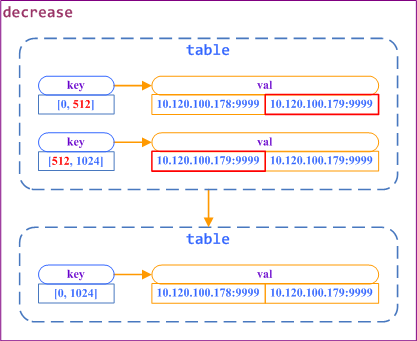

负载均衡表
--

路径：`hustdb/ha/nginx/conf/hustdbtable.json`

### 配置范例 ###

以下是 `hustdbtable` 的标准配置样例：

    {
        "table":
        [
            { "item": { "key": [0, 128], "val": ["10.120.100.178:9999", "10.120.100.178:9998"] } },
            { "item": { "key": [128, 256], "val": ["10.120.100.178:9998", "10.120.100.179:9999"] } },
            { "item": { "key": [256, 384], "val": ["10.120.100.179:9999", "10.120.100.179:9998"] } },
            { "item": { "key": [384, 512], "val": ["10.120.100.179:9998", "10.120.100.180:9999"] } },
            { "item": { "key": [512, 768], "val": ["10.120.100.180:9999", "10.120.100.180:9998"] } },
            { "item": { "key": [768, 1024], "val": ["10.120.100.180:9998", "10.120.100.178:9999"] } }
        ]
    }

以下是 `hustdbtable` 进行扩容的配置样例：

    {
        "table":
        [
            {
                "item": { "key": [0, 256], "val": ["10.120.100.178:9999", "10.120.100.179:9999"] },
                "increase":
                {
                    "low": { "key": [0, 128], "val": ["10.120.100.178:9999", "10.120.100.178:9998"] },
                    "high": { "key": [128, 256], "val": ["10.120.100.178:9998", "10.120.100.179:9999"] }
                }
            },
            {
                "item": { "key": [256, 512], "val": ["10.120.100.179:9999", "10.120.100.180:9999"] },
                "increase":
                {
                    "low": { "key": [256, 384], "val": ["10.120.100.179:9999", "10.120.100.179:9998"] },
                    "high": { "key": [384, 512], "val": ["10.120.100.179:9998", "10.120.100.180:9999"] }
                }
            },
            {
                "item": { "key": [512, 1024], "val": ["10.120.100.180:9999", "10.120.100.178:9999"] },
                "increase":
                {
                    "low": { "key": [512, 768], "val": ["10.120.100.180:9999", "10.120.100.180:9998"] },
                    "high": { "key": [768, 1024], "val": ["10.120.100.180:9998", "10.120.100.178:9999"] }
                }
            }
        ]
    }

以下是 `hustdbtable` 进行减容的配置样例：

    {
        "table":
        [
            {
                "item": { "key": [0, 128], "val": ["10.120.100.178:9999", "10.120.100.178:9998"] },
                "decrease": { "remove": "10.120.100.178:9998", "replace_by": "10.120.100.179:9999" }
            },
            {
                "item": { "key": [128, 256], "val": ["10.120.100.178:9998", "10.120.100.179:9999"] },
                "decrease": { "remove": "10.120.100.178:9998", "replace_by": "10.120.100.178:9999" }
            },
            {
                "item": { "key": [256, 384], "val": ["10.120.100.179:9999", "10.120.100.179:9998"] },
                "decrease": { "remove": "10.120.100.179:9998", "replace_by": "10.120.100.180:9999" }
            },
            {
                "item": { "key": [384, 512], "val": ["10.120.100.179:9998", "10.120.100.180:9999"] },
                "decrease": { "remove": "10.120.100.179:9998", "replace_by": "10.120.100.179:9999" }
            },
            {
                "item": { "key": [512, 768], "val": ["10.120.100.180:9999", "10.120.100.180:9998"] },
                "decrease": { "remove": "10.120.100.180:9998", "replace_by": "10.120.100.178:9999" }
            },
            {
                "item": { "key": [768, 1024], "val": ["10.120.100.180:9998", "10.120.100.178:9999"] },
                "decrease": { "remove": "10.120.100.180:9998", "replace_by": "10.120.100.180:9999" }
            }
        ]
    }
    
### 字段结构 ###

[`table`](table/table.md)   
　　[`hash_item`](table/hash_item.md)  
　　　　[`item`](table/item.md)  
　　　　　　[`key`](table/key.md)  
　　　　　　[`val`](table/val.md)  
　　　　[`increase`](table/increase.md)  
　　　　　　[`low`](table/low.md)  
　　　　　　　　[`key`](table/key.md)  
　　　　　　　　[`val`](table/val.md)  
　　　　　　[`high`](table/high.md)  
　　　　　　　　[`key`](table/key.md)  
　　　　　　　　[`val`](table/val.md)  
　　　　[`decrease`](table/decrease.md)  
　　　　　　[`remove`](table/remove.md)  
　　　　　　[`replace_by`](table/replace_by.md)  

### 字段约束 ###

* [`increase`](table/increase.md) 和 [`decrease`](table/decrease.md) 用于集群的扩容和减容，只能定义一种，不可以两种都定义。

* [`key`](table/key.md) 用于定义负载均衡的 `hash` 算法区间，其范围为 `[0, 1024)` ，实际的配置， **各个区间必须连续** ，否则会有部分的 `key` 无法 `hash` 到对应的存储机。

* [`val`](table/val.md) 用于定义实际的存储机器列表，该字段的值分别存放存储的主节点以及备用主节点（目前的设计为 **主 - 主** 模型）

* [`increase`](table/increase.md) 的语义只允许将一个区间一分为二，且分解后的两个区间必须 **连续** ，例如 `[0, 1024]` 可分解为 `[0, 512]` 、`[512, 1024]` 。  
具体做法参考下图：  

* [`decrease`](table/decrease.md) 的语义只允许针对连续的两个区间进行合并，例如  `[0, 512]` 、`[512, 1024]` 可合并为  `[0, 1024]` 。  
具体做法参考下图：  

### 一键生成负载均衡表 ###

工具目录：`hustdb/ha/nginx/conf/gen_table.py`

用法：

    usage:
        python gen_table.py [host_file] [output]
    sample:
        python gen_table.py hosts hustdbtable.json
举例，在目录 `hustdb/ha/nginx/conf` 下新建 `hosts` 文件，编辑内容如下：

    192.168.1.101:9999
    192.168.1.102:9999
    192.168.1.103:9999
运行如下命令：

    python gen_table.py hosts hustdbtable.json
打开 `hustdbtable.json` ，可以看到内容如下：
    
    {
        "table": [
            {
                "item": {
                    "val": [
                        "192.168.1.101:9999", 
                        "192.168.1.102:9999"
                    ], 
                    "key": [
                        0, 
                        256
                    ]
                }
            }, 
            {
                "item": {
                    "val": [
                        "192.168.1.102:9999", 
                        "192.168.1.103:9999"
                    ], 
                    "key": [
                        256, 
                        512
                    ]
                }
            }, 
            {
                "item": {
                    "val": [
                        "192.168.1.103:9999", 
                        "192.168.1.101:9999"
                    ], 
                    "key": [
                        512, 
                        1024
                    ]
                }
            }
        ]
    }

实际部署集群的时候， **强烈推荐用此方法生成负载均衡表** 。

[上一级](conf.md)

[根目录](../../index.md)