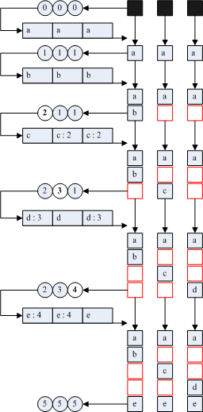

ha
--

### 接口概要 ###

以下是 `hustmq ha` 提供的 http 接口：

* [autost](ha/autost.md)
* [stat_all](ha/stat_all.md)
* [stat](ha/stat.md)
* [put](ha/put.md)
* [get](ha/get.md)
* [ack](ha/ack.md)
* [timeout](ha/timeout.md)
* [lock](ha/lock.md)
* [max](ha/max.md)
* [purge](ha/purge.md)
* [worker](ha/worker.md)
* [evget](ha/evget.md)
* [evsub](ha/evsub.md)
* [sub](ha/sub.md)
* [pub](ha/pub.md)
* [do_get](ha/do_get.md)
* [do_post](ha/do_post.md)
* [do_get_status](ha/do_get_status.md)
* [do_post_status](ha/do_post_status.md)

### 常见问题 ###

* 返回值  
所有接口通过 `http code` 来表示执行结果，`200` 表示执行成功，`404` 表示执行失败。

* 关于 `http basic authentication`  
本节所有以 `curl` 命令描述的测试样例均假设 `http basic authentication` 被关闭。  
具体做法可参考 [这一节](../advanced/ha/nginx.md) 的末尾对常见问题的解答。

* 关于 `timeout` 接口的使用场景  
假定队列名称为 `test_queue` ，数据为 `test_data`。
    * 通过 `put` 接口向 `test_queue` 写入数据 `test_data`
    * 调用 `timeout` 接口设置 `test_queue` 超时时间为 1 分钟
    * 调用 `get` 接口从 `test_queue` 中获取数据，其中 `ack` 参数设置为 `false`
    * 情形一：
        * 等待 1 分钟以上，期间不进行 `ack` 操作
        * 再次调用 `get` 接口从 `test_queue` 中获取数据，可以发现取到的依然是 `test_data`
    * 情形二：
        * 不等待，调用 `ack` 接口对数据进行确认
        * 再次调用 `get` 接口从 `test_queue` 中获取数据，可以发现取不到 `test_data` 

* 关于 `http push` 的运作机制  
[evsub](ha/evsub.md) 、[sub](ha/sub.md)、[pub](ha/pub.md) 配合可以实现 `http push` 机制，用作数据的流式推送。具体的运作流程如下：  
    * `subscriber` 利用 `evsub` 接口向 `test_queue` 订阅数据
    * `publisher` 利用 `pub` 接口向 `test_queue` 推送数据
    * `hustmq ha` 后台的 `autost` 过程会刷新 `hustmq` 集群状态，检测 `test_queue` 是否有数据可获取
    * `hustmq ha` 检测到 `test_queue` 有数据可获取， 从而自动生成获取 `test_queue` 数据的 `uri`（含 `sub` 接口），打包在 `http` 头部，向 `subscriber` 回复 `307`，`subscriber` 会利用新的 `uri` 获取最新的 `test_queue` 的数据  
为了保证推送数据的最终一致性，`hustmq` 实现了一套轻量级的分布式滑动窗口，类似下图：  
  
其中 `[a, b, c, d, e]` 代表写入的数据，红色的部分表示写入失败的数据，`c:2` 代表在写入数据 `c` 的时候强制将 `idx` 更新为最新的值 `2`。当 `hustmq ha` 发现 `hustmq` 各个节点的 `idx` 不一致的时候，会自动通知各个节点将 `idx` 更新到最新的值，从而保证最终的一致性。

* 关于 `long polling` 的运作机制  
[evget](ha/evget.md) 和 [evput](ha/put.md) 配合可以实现 `long polling` 机制。具体的运作流程如下：
    * `client A` 向 `hustmq ha` 发送 `evget` 请求，请求的队列名称为 `test_queue`，则该请求会被 `hustmq ha` 挂住
    * `client B` 向 `hustmq ha` 发送 `put` 请求，向 `test_queue` 投递数据
    * `hustmq ha` 后台的 `autost` 过程会刷新 `hustmq` 集群状态，检测 `test_queue` 是否有数据可获取
    * `hustmq ha` 检测到 `test_queue` 有数据可获取，从而自动生成获取 `test_queue` 数据的 `uri`，打包在 `http` 头部，向 `client A` 回复 `307`，`client A` 会利用新的 `uri` 获取最新的 `test_queue` 的数据  
    **动画效果:**  
    

* 基于 `http` 的分布式进程池的机制  
传统的进程池的实现中，所有 `worker` 进程分布在同一台机器上，具有单点限制。[do_get](ha/do_get.md) 和 [do_post](ha/do_post.md) 配合可以实现基于 `http` 的分布式进程池。其具体的工作流程如下：  
    * `worker` 向 `hustmq ha` 发送 `do_post` 请求，认领任务，该请求会被 `hustmq ha` 挂住；
    * `client` 向 `hustmq ha` 发送 `do_get` 请求，投递任务，该请求会被 `hustmq ha` 挂住；
    * `hustmq ha` 将 `client` 投递过来的任务转发给 `worker` 进行处理；
    * `worker` 将任务处理完毕，通过 `do_post` 接口返回处理结果；
    * `hustmq ha` 将处理结果转发给 `client`  

以上过程，如果站在 `client` 视角，整个任务的处理过程是同步的，因此 `client` 可以用同步调用的方式使用消息队列，无需维护自己的上下文，从而简化代码的编写方式；如果站在 `worker` 的视角，其表现行为和传统的进程池的 `worker` 进程非常类似，而且没有单机的限制，也没有语言的限制，属于一种全新的 `RPC` 设计方式，在部署上非常灵活简单，各个 `worker` 的实现可以不必局限于一种特定的语言，只需要按照 `do_post` 接口的规范进行调用即可。

[上一级](index.md)

[根目录](../index.md)